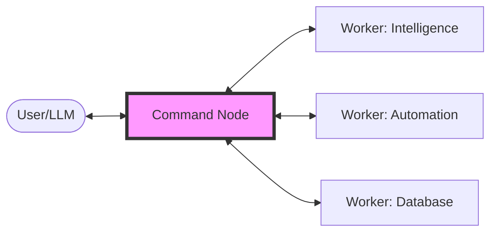

<div align="center">

# 🌌 Swarms-on-Edge
### The Distributed Model Context Protocol (MCP) Orchestrator

[]()
[]()
[]()

**Swarms-on-Edge** is a game-changing framework for deploying decentralized AI agent swarms. It allows you to break free from single-server limitations by orchestrating a fleet of specialized MCP workers distributed across your local network, remote VPS, or edge devices.

[**Architectural Blueprint**](./blueprint.md) | [**Quick Start**](#-quick-start) | [**Documentation**](#-core-concepts)

</div>

---

## 🚀 Why Swarms-on-Edge?

Current AI agent setups are often monolithic and hard to scale. **Swarms-on-Edge** introduces a decentralized paradigm:

- **Infinite Scalability**: Add specialized workers (Scrapers, DB Agents, CRM Experts) on the fly.
- **Unified Interface**: The Command Node aggregates all tools into a single MCP endpoint for Claude, Cursor, or any MCP-compatible host.
- **Resource Efficiency**: Run heavy tools (like Puppeteer or 3D rendering) on powerful edge servers while keeping your main AI client lightweight.
- **Fault Tolerance**: If one worker goes down, the rest of the swarm remains operational.

---

## 🏗️ Architecture

Swarms-on-Edge uses a **Hub-and-Spoke** model optimized for high-velocity tool execution.



---

## 🛠️ Tech Stack

- **Orchestration**: Node.js, Hono, MCP SDK.
- **Edge Workers**: Python (FastMCP), FastAPI.
- **Communication**: JSON-RPC over SSE (Server-Sent Events).
- **Deployment**: Docker, Docker Compose.

---

## 🏁 Quick Start

### 1. Clone the Swarm
```bash
git clone https://github.com/EdgeAgent/swarms-on-edge.git
cd swarms-on-edge
```

### 2. Launch the Fleet
```bash
docker-compose up --build
```

### 3. Connect to your AI Client
Add the Command Node to your `claude_desktop_config.json`:
```json
{
  "mcpServers": {
    "swarms-on-edge": {
      "command": "node",
      "args": ["/path/to/swarms-on-edge/command-node/dist/index.js"]
    }
  }
}
```

---

## 🌟 Featured Tools (Out of the Box)

| Tool Name | Description | Worker Type |
| :--- | :--- | :--- |
| `intel__analyze_lead_website` | Deep AI analysis of business value props. | Intelligence |
| `intel__search_business_leads` | Niche-specific lead generation. | Intelligence |
| `auto__register_worker` | Dynamically expand the swarm at runtime. | System |

---

## 🤝 Contributing

We are building the future of autonomous agentic swarms. Join us!

1. Fork the Project
2. Create your Feature Branch (`git checkout -b feature/AmazingFeature`)
3. Commit your Changes (`git commit -m 'Add some AmazingFeature'`)
4. Push to the Branch (`git push origin feature/AmazingFeature`)
5. Open a Pull Request

---

<div align="center">
  Built with ⚡ by <b>Edge Agency</b><br>
  <i>"The best way to predict the future is to automate it."</i>
</div>
